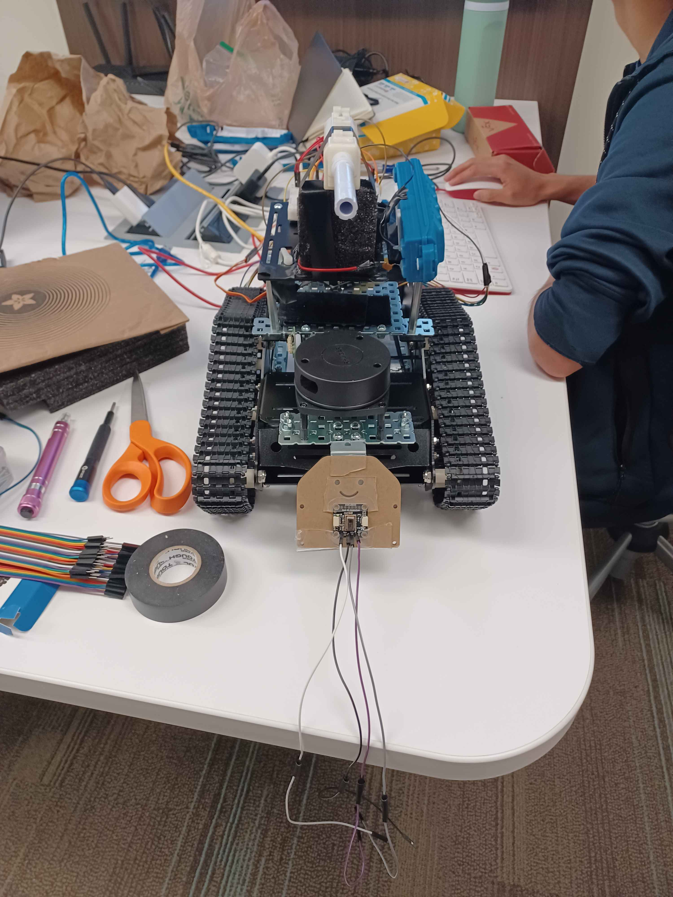

# Documentation of Robot Scope and Contributors for Introduction to Robotics Final Project

## Robot Scope
The Autonomous Detection and Engagement Platform Tank (ADEPT) navigates a space with LIDAR and Tank Tread Wheels.
It fires a Gel Blaster at objects with high heat mass detected on the Thermal Camera.

## Component Folders
Every component neccessary for the robot to operate in its full scope should have a folder for said part. 
There is a markdown file for understanding the usage and operation of the component.

## Archive Folder
Old files made when everyone worked on component files individually before integration

## Physical Robot Components for replication
- RPi 4
- Keyestudio DIY Mini Tank V2 Robot IR sensor, Development Board, & Motor Shield
- AMG8833 Thermal Camera
- RPLIDAR A2M12 360° Laser Range Scanner
- 2x BTS7960 motor drivers
- Gel Blaster
- 12V 5A Batterypack
- Sunfounder Robot Hat

## Contributors
- Andres Armendariz (Wheel Motors & Electrical Manager)
- Li Fitzgerald (Thermal Camera & Code Integrator)
- Anthony Gendreau (Chassis)
- August Ramberg (Firing Actuator, IR Remote, Code Integrator)
- Gabriel Rodriguez (LIDAR & General Component Programmer)
